# Revenue Watchdog

**Retry congestion control for the Razorpay network.**

Razorpay AI Buildathon 2026 — Track 3, AI Revenue Recovery.

---

## The problem a single merchant cannot solve

When an issuer degrades, every merchant's dunning logic notices at roughly the same
moment and starts retrying. None of them can see each other. So a bank that is
already struggling receives a synchronised burst of retry traffic from thousands of
merchants at once, on top of its organic load. The retries make the outage deeper and
longer, every merchant's success rate drops further, and the queue grows.

Each merchant behaved rationally. Collectively they made their own problem worse.

A merchant-side tool cannot fix this. It has exactly one lever — its own retries — and
unilaterally holding back just means it recovers less while everyone else still
stampedes. The only place the problem is solvable is the layer that can see all the
merchants at once.

That is the layer this is built on. Revenue Watchdog meters total retry traffic to a
degraded issuer against estimated capacity, spreads attempts across time slots instead
of firing them together, and allocates the scarce early slots by expected value under a
per-merchant floor — so the highest-value recoveries go first, rather than whoever
happened to run their cron job at `:00`, but the smallest merchants are not starved out
of a window they are being throttled into. What that floor costs is measured and
published rather than assumed; see [Who gets the scarce slots](#who-gets-the-scarce-slots).

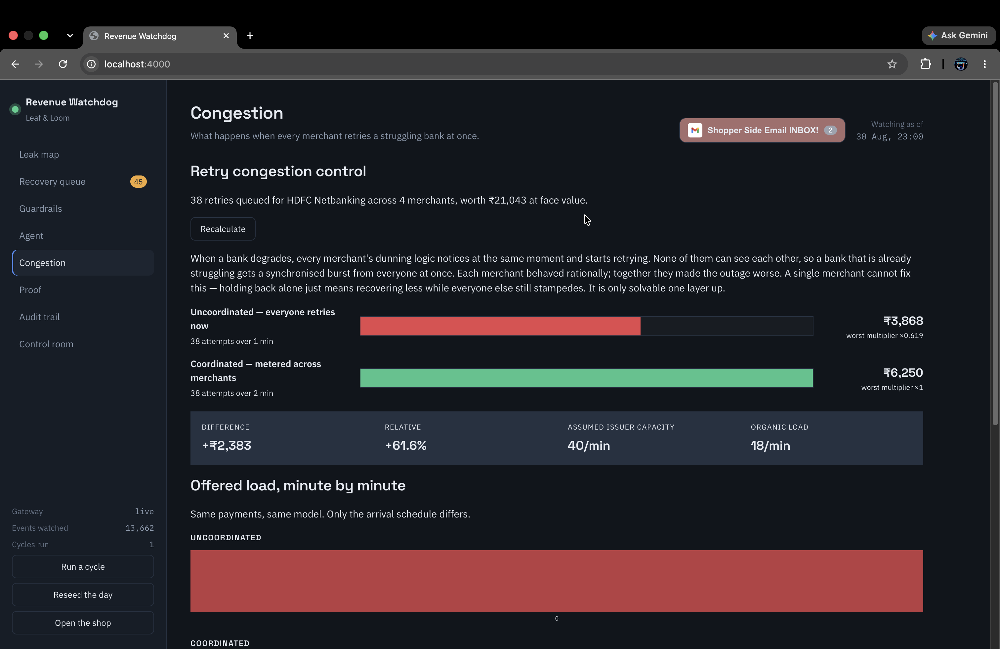

*Sidebar → Congestion. Total retry traffic to a degraded issuer, network-wide.*

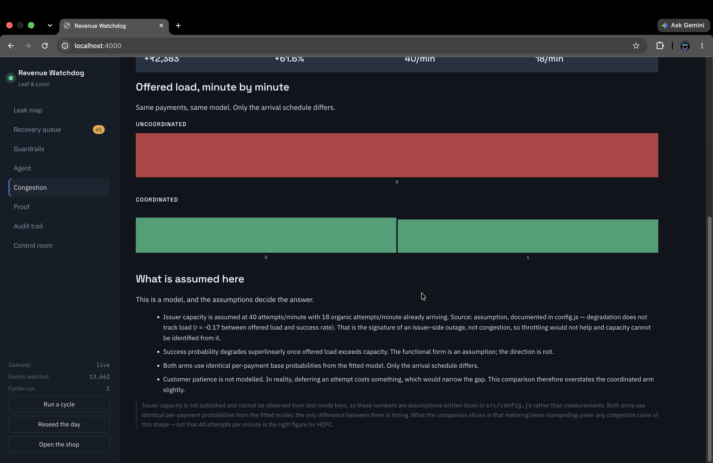

*The same queue, metered. Deferred attempts are visible, not silently dropped.*

---

## Headline result

Thirty independent days, control versus treatment, same seeded traffic:

| | Decisions | Recovered | Rate |
|---|---:|---:|---:|
| Control (naive dunning) | 166 | 100 | 60.2% |
| Treatment (Watchdog) | 712 | 543 | **76.3%** |

Absolute lift **+16.02pp**. Relative lift **26.6%**. p **< 0.0001**. Incremental
recovery **₹94,802** over what the control arm's rate would have produced.

Reproduce exactly:

```bash
npm run accumulate
```

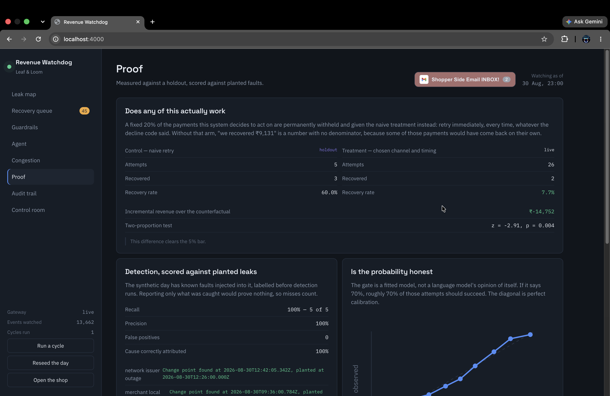

*Sidebar → Proof. The holdout split, arm sizes, and the significance gate.*

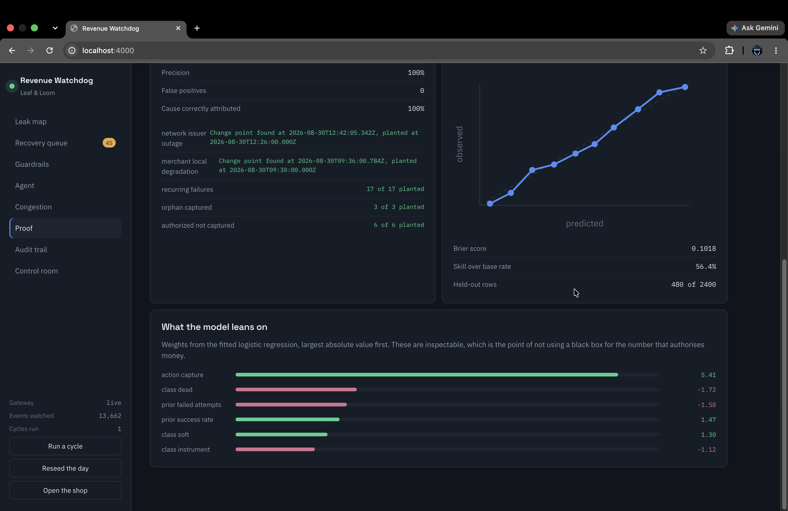

*The same number the panel shows, produced from the command line.*

Byte-identical between runs and between machines. If your numbers differ from
the table above, that is a bug and I want to know about it — see
[What broke](#what-broke) for why that sentence is in this README twice.

**Why thirty days and not one.** 24 of the 30 days showed positive lift; 6 showed
negative. Same system, same logic, opposite headline. Any single day of this data
can be made to say whatever you want it to say, which is why the product refuses
to print a lift figure until both arms are large enough to support one. A demo
that runs once and reports its best day is reporting noise.

**Why the control arm is not a strawman, and where it is.** Control is naive
dunning: retry immediately, every time, whatever the decline code said. That is
genuinely what an unconfigured retry loop does, and it is the thing most
merchants actually run. It is *not* a fair stand-in for a well-tuned commercial
dunning tool, which would already respect decline codes. Read the lift as
"against doing the obvious thing", not "against the best available product".

## Run it

No API keys. No tunnel. No signup.

```bash
git clone <this-repo>
cd Revenue-Watchdog
node server.js
```

Boots in ~600ms with 13,629 seeded payments across 6 merchants, a fitted recovery
model, and a populated recovery queue. Opens at `http://localhost:4000`.

There are zero npm dependencies. `package.json` has an empty `dependencies` block and
that is not an oversight — no install step means nothing to break between your machine
and mine. Node 20.6+ only.

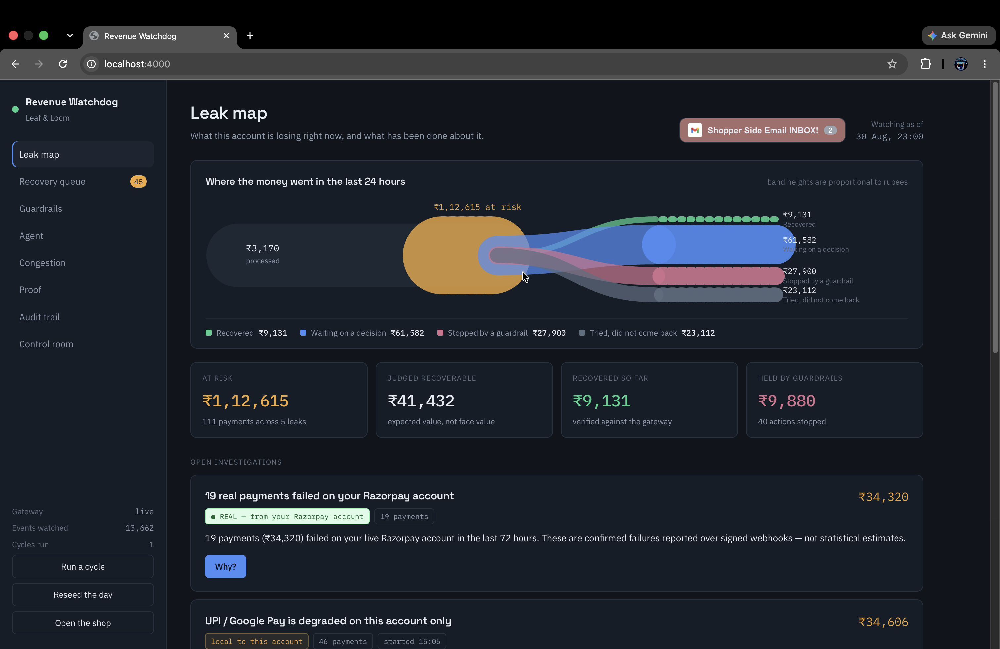

*The landing view on boot. At-risk revenue bucketed by cause.*

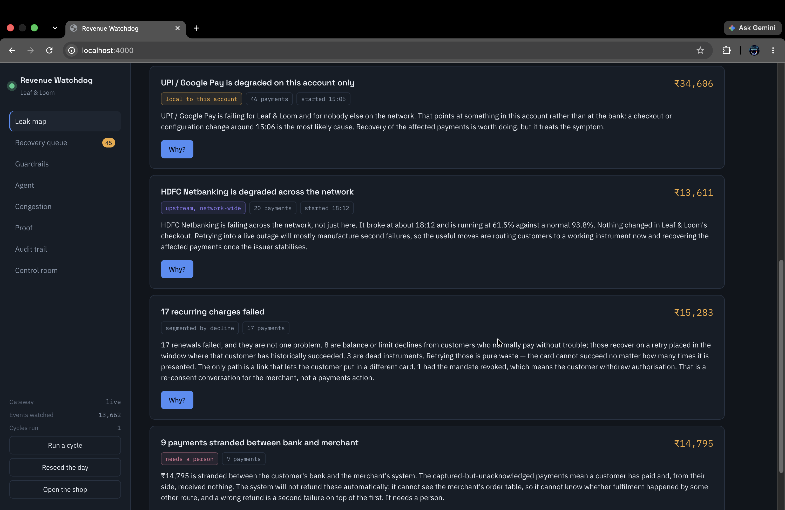

*Recovered, waiting on a decision, stopped by a guardrail, tried and did not come back.*

Live Razorpay and Gemini setup is in [Running it for real](#running-it-for-real).
The zero-config path exists so you can evaluate the system before deciding whether to
wire up credentials.

---

## The agent cannot move money

This is an architectural claim, not a policy one.

The agent has nine tools. Eight are read-only: `list_open_leaks`, `inspect_payment`,
`get_decline_breakdown`, `get_customer_history`, `estimate_recovery_probability`,
`check_congestion`, `compare_across_network`, `simulate_policy_change`. The ninth,
`propose_recovery_posture`, writes a proposal and nothing else.

There is no route from the model to the executor. Every action passes through a
deterministic policy engine that reads structured candidate fields and never reads free
text, and that engine returns one of `AUTO`, `REVIEW`, or `BLOCK`. A perfectly
successful prompt injection still cannot cause a payout, because the capability is not
in the model's hands to begin with.

Three assertions in the test suite pin this down, and they would fail loudly if someone
later handed the agent a write tool:

```
ok    the agent has no tool that can move money
ok    the only write-shaped tool is a proposal
ok    nothing executed without a rule authorising it
```

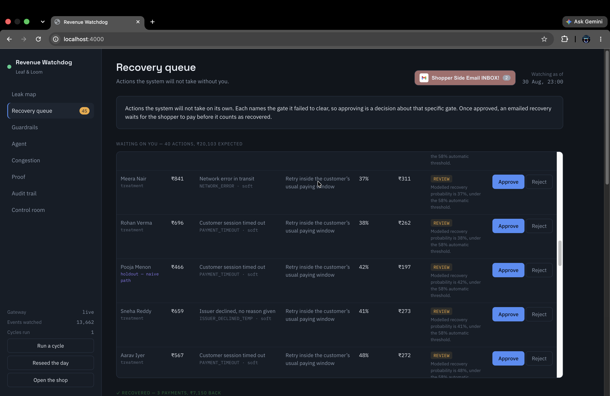

*Sidebar → Recovery queue. Escalation and stopping rules in one frame.*

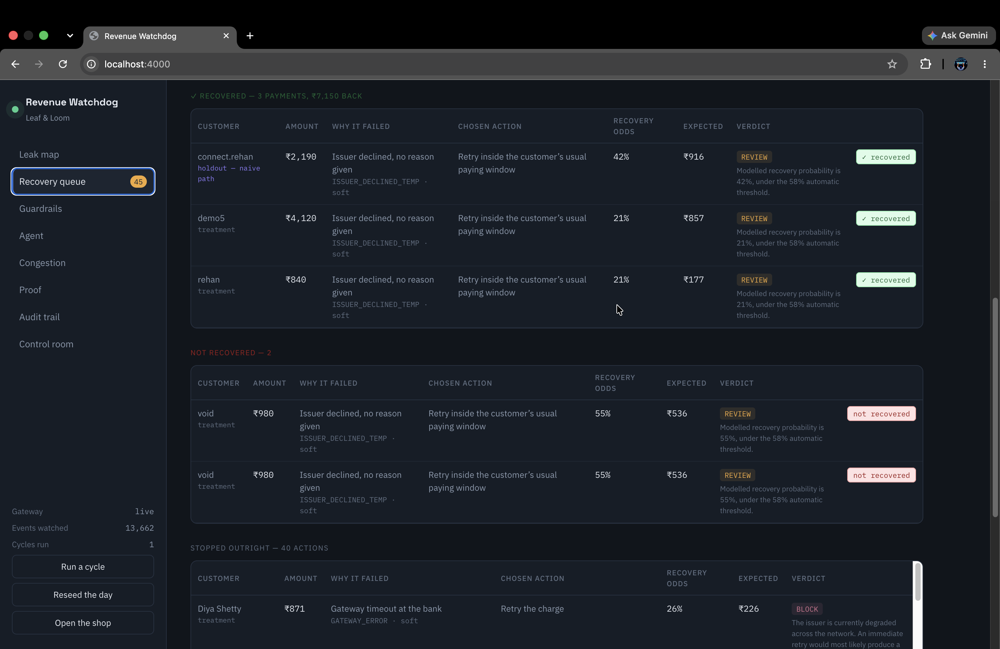

*BLOCK is a decision with a reason attached, not an error.*

### The agent is not allowed to be the source of a number

The failure mode of an LLM in a money system is not refusing to answer. It is answering
fluently with a figure that came from nowhere. "Recovery probability is about 85%" reads
exactly like a real estimate, and a merchant cannot tell the difference.

So every claim must cite a `factId` from a tool result, and every number inside that
claim must actually appear in that tool result. Claims that fail either check are
rejected and sent back for another attempt.

One detail worth naming, because it came from a real failure: payment IDs like
`pay_223815981edb81` contain digit runs, and harvesting those into the pool of supported
numbers let a fabricated `87.3%` validate against an `87` that was a fragment of a random
ID. Identifiers and timestamps are now excluded by key and by shape. A validator that can
be satisfied by coincidence is worse than no validator, because it looks like a guarantee.

### Untrusted text is treated as untrusted

Payment descriptions, customer names, invoice line items and order notes are written by
people outside the system. Some of those people would like the agent to refund them.
Injected content is replaced rather than passed through with a warning, because a
warning still puts the payload in the model's context, and the payload is the thing that
does the damage.

Pattern detection is the weakest of the three layers and is deliberately ranked last.
It earns its place by making attempts visible to the merchant, not by stopping them.

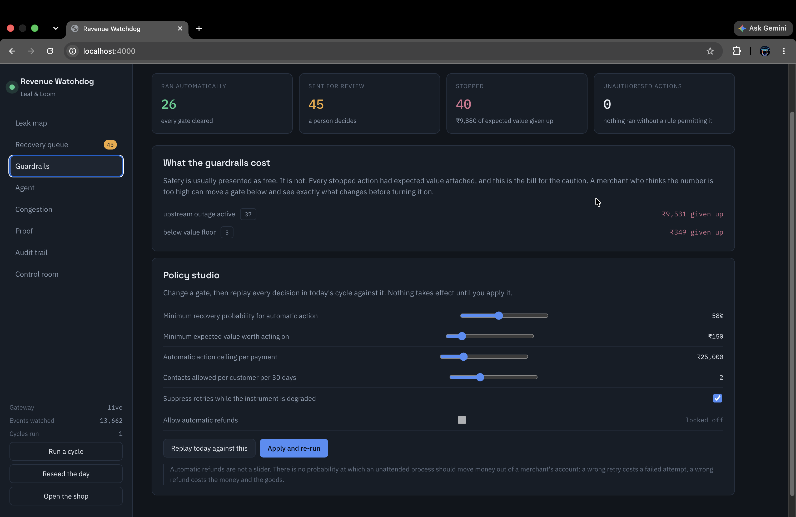

*Sidebar → Guardrails. Capture after `npm run evals` so the log has real entries.*


*Replacement, not a warning — a warning still puts the payload in context.*

---

## What is verified

```bash
npm test      # 66 assertions, 0 failures
npm run evals # 12 agent scenarios
```

The test suite covers policy gating, idempotency under replay, webhook HMAC
verification and deduplication, out-of-order event handling, agent capability limits,
claim validation, injection handling, congestion monotonicity, recovery attribution,
and accounting identities (recovered never exceeds at-risk; flow buckets sum to the
total).

Four groups exist specifically because a claim in this README turned out to be
false. **Reproducibility** pins that a payment lands in the same experiment arm
on every run. **Measurement** pins that the pooled lift is positive, over twenty
days rather than eight because at eight the result swings on which seeds you draw
— the same sample-size argument this README makes about its own headline figure.
**Capacity estimation** pins that the estimator recovers a planted capacity *and*
declines an outage carrying the same success-rate drop. **Fairness** pins that the
floor really does cost recovery, because a fairness knob that costs nothing is not
doing anything.

The eval harness scores four things per scenario: did it attribute the right root
cause, did it recommend the right posture, did every claim survive the validator, and
how many tool calls it took. It deliberately includes scenarios the agent is supposed
to find unwinnable — thin data where the correct answer is "inconclusive", and payments
carrying injection payloads where the correct behaviour is to ignore them. A harness
that only contains winnable scenarios measures nothing.

Current: **10 of 12 pass.** Cause attribution 100%, posture selection 100%, fully
grounded on all runs, 3.7 tool calls average.

The two failures are real and are described under [Known limitations](#known-limitations).

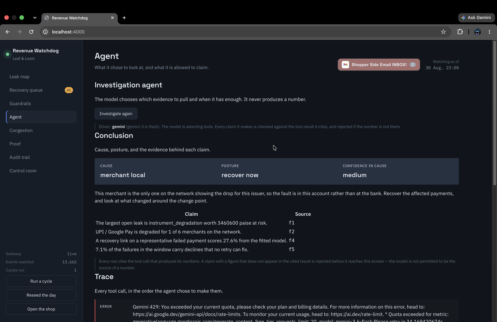

*Sidebar → Agent. Eight read-only tools, and the order it chose to call them in.*

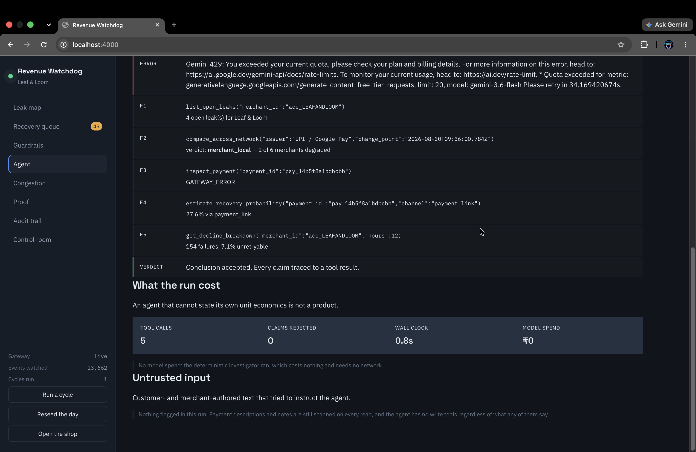

*A number that cannot be traced to a tool result is rejected before it reaches you.*

---

## What is real and what is modelled

| Piece | Status |
|---|---|
| Storefront checkout | Real — Razorpay Checkout.js, real orders, real test-mode payments |
| Webhook ingestion | Real — HMAC-verified, deduplicated, replay-safe |
| Recovery actions | Real — payment links, captures, refunds via Razorpay API |
| Recovery attribution | Real — `payment_link.paid` closes the loop back to the deciding action |
| Agent investigation | Real — Gemini 2.5 Flash tool-use loop, verified working in live mode |
| Detection statistics | Real — CUSUM, MLE change-point, beta-binomial |
| Recovery model | Real — Brier 0.1018, skill 56.4% on 480 held-out rows |
| Issuer capacity | **Estimated from observed traffic where the traffic can identify it; assumed where it cannot, and it says which** |
| Background traffic | Synthetic — 13,629 seeded payments so the leak map has context |
| Issuer congestion response | Modelled, not measured — see below |
| Shopper link completion | Modelled, not measured — see below |

Three assumptions are load-bearing and none of them are observations.

**The congestion curve.** Real issuer behaviour under load is not published and
would have to be learned from production traffic. What is defensible is the
shape: success probability degrades as offered load exceeds capacity, and
degrades faster once the queue starts building. The A/B stays honest because
**both arms use the same congestion model**. What is demonstrated is that
scheduling beats not scheduling under any plausible curve, not that a particular
attempts-per-minute figure is correct.

**Shopper link completion** (`LINK_COMPLETION` in `config.js`). A payment link is
not an instruction to a bank, it is a request to a human, and the instrument
working is necessary but not sufficient. 0.62 sits inside the band that published
cart-recovery benchmarks cluster in for transactional mail about an order the
shopper already tried to place. The loyalty and fatigue terms are directional.

This one is not decoration. Without it a link out-scores a retry on every decline
class, and the planner learns to spam links at soft declines that a silent retry
would have cleared for free. With it, the link wins exactly where it should —
dead instruments and revoked mandates, where retrying the same instrument has no
path to success at all.

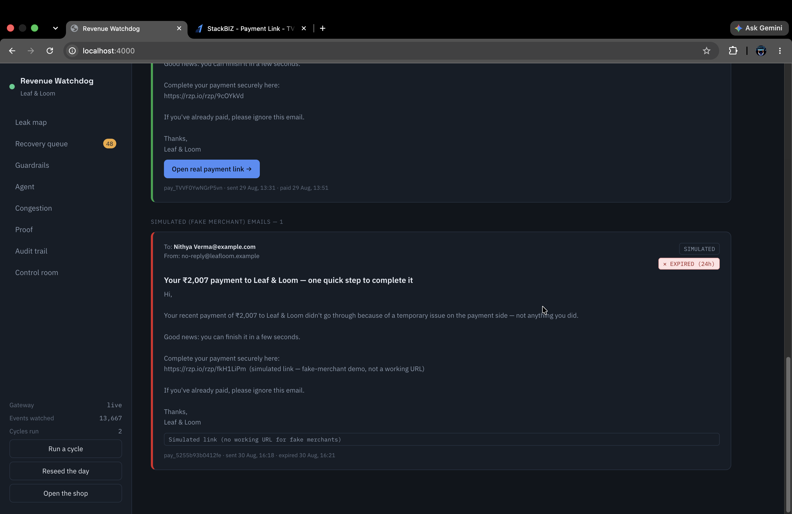

*Mail generated for seeded candidates. Approve something in the Recovery queue to
fill this; soft declines are retried silently and never generate mail, which is
the point.*

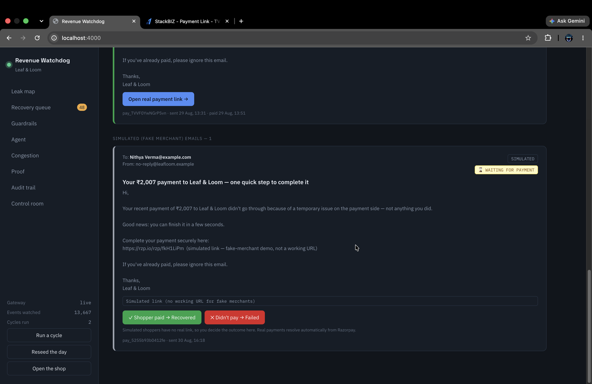

*Resolving it here is what settles the action in the UI. In the headless A/B a
sampler does the same job, and never for a real payment.*

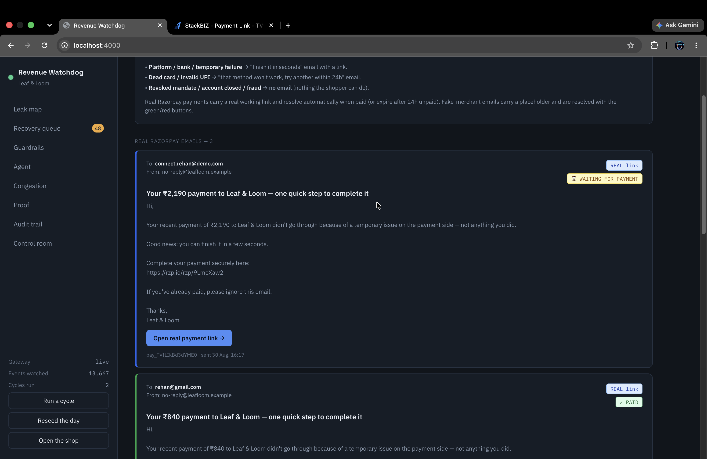

*Mail generated for genuine test-mode payments, listed separately from the
simulated ones. Real and seeded traffic are never mixed in the same count.*

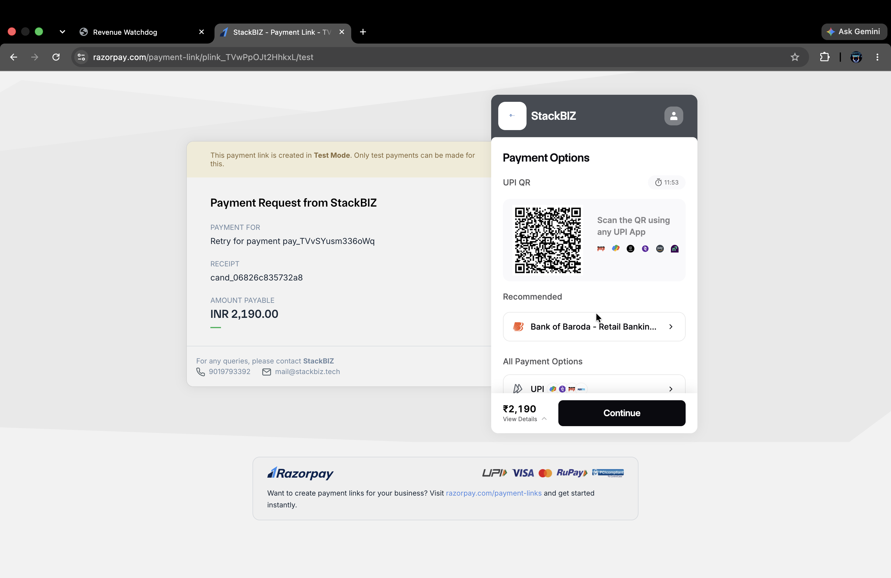

*This link is live. Paying it produces a `payment_link.paid` webhook, which is
what closes the loop back to the deciding action.*

**Issuer capacity** is no longer in this list as a flat assumption; see
[Learning capacity instead of assuming it](#learning-capacity-instead-of-assuming-it).

### The circularity this design does not escape

Stated plainly because a reviewer will work it out and finding it unstated is
worse.

`trueRecoveryProbability()` in `seed/generator.js` is the hidden process that
outcomes are sampled from. `contextFor()` in `pipeline/planner.js` builds the
feature vector the policy reasons over. **They take the same arguments.** The
generator is a hand-written function with no unobserved confounders and no noise
beyond Bernoulli sampling, and the model is correctly specified against it.

Two consequences, both real:

1. **A Brier of 0.1018 is a flattering number.** It says the logistic regression
   successfully learned a function that was learnable by construction. It does
   not say anything about how the model would do on production traffic, where
   features are noisy and the true process is unknown.
2. **The A/B validates the measurement machinery, not the effect size.** Holdout
   assignment, arm accounting, attribution, significance gating, the refusal to
   quote a lift at small n — all of that is exercised and all of it is real. The
   +16.02pp itself is a statement about this simulator.

What would break the circularity is the live path: real Razorpay test-mode
payments carry a `source` marker, are never given fabricated outcomes, and stay
`pending` until a webhook says otherwise. That path is small — it is one merchant
and however many payments you make by hand — but it is the only part of this
system where the number is not downstream of an assumption I wrote.

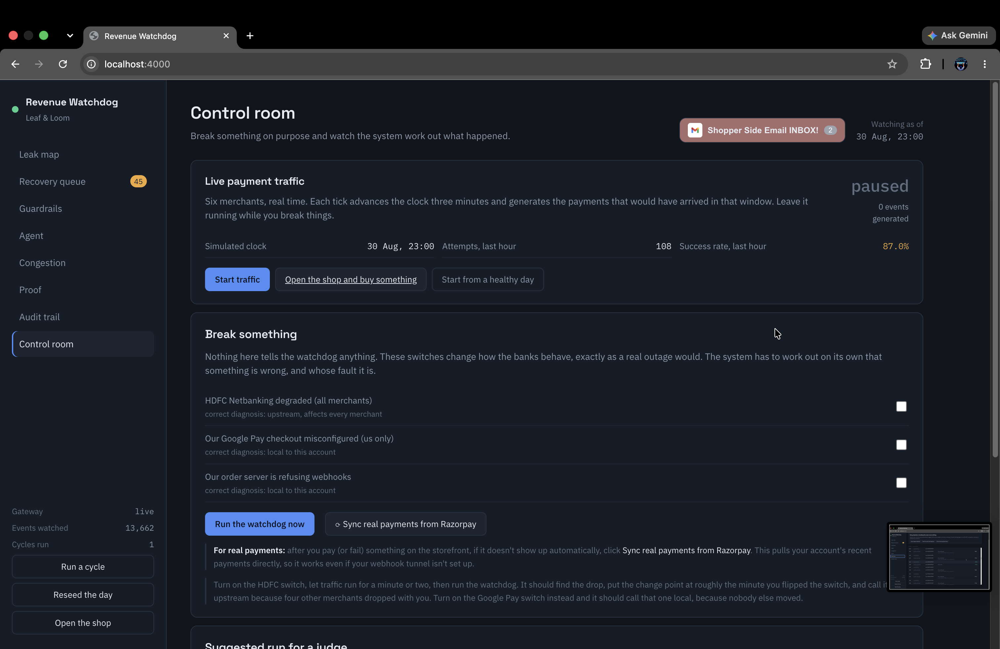

*Sidebar → Control room. Plant any of the twelve scenarios and watch the pipeline respond to it live.*

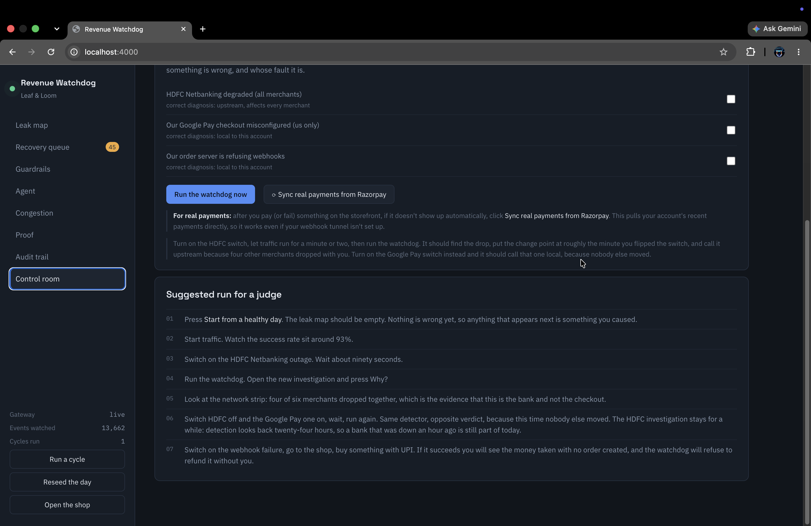

*`simulate_policy_change` shows what a threshold move would have done to past decisions, before it moves anything.*

## Learning capacity instead of assuming it

The scheduler meters retry traffic against an issuer's capacity. That number
used to be a constant in `config.js` — labelled as a guess, but still a guess
that every scheduling decision inherited.

`pipeline/capacity.js` estimates it instead. The congestion model asserts

```
observed_success_rate(t) ≈ baseline_rate × congestionMultiplier(load(t), C)
```

and load and success rate are both just attempt counts bucketed over time, so C
is the only unknown. It is fitted by weighted grid search with a bootstrapped 90%
interval.

**The interesting part is what stops it answering.** An estimator that always
produces a number is worse than the assumption it replaced, so there are three
gates:

1. **Not enough usable buckets.** A bucket with two attempts has a success rate
   of 0% or 100% and contributes noise, not signal.
2. **A fit on the edge of the search grid.** That is the optimiser running out of
   room, which means the likelihood is monotone across everything searched and
   the data does not constrain the parameter. Reporting the boundary would dress
   "no information" up as precision.
3. **Degradation that does not track load.** This is the one that matters. An
   issuer having a bad afternoon for its own reasons produces exactly the same
   depressed success rate as congestion does. Only the *relationship to load*
   separates them, so the estimate is gated on that correlation being present
   and negative. Without this gate the estimator confidently learned an absurdly
   low capacity from the planted outages in the seed data — and would then have
   throttled traffic that was never the problem.

On the seeded demo world it declines on all ten issuers and says why for each:
13,629 payments over 157 hours is roughly 1.4 attempts per minute against a
40–90/min ceiling, so nothing ever approaches capacity and capacity is not
identifiable. That is the correct answer, and the tests prove the estimator can
still find a capacity when one is really there — it recovers a planted C of 60
inside its interval, and declines a time-driven outage carrying the same
success-rate drop.

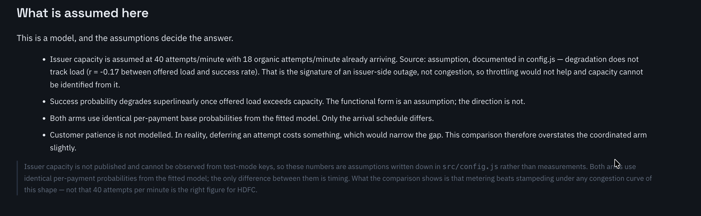

*"What is assumed here." The estimator refusing is the feature, not a gap.*

Every surface that shows a capacity figure also shows `capacity_is_measured` and
the reason. The agent's `check_congestion` tool gets both, so it cannot state an
assumption as an observation.

---

## Who gets the scarce slots

`probability × amount` is not a neutral tie-break. During an outage it means a
₹50,000 order beats a ₹200 order every single time, so the smallest merchants on
the network are served last and, if the queue never drains, not at all — while
being throttled by a gateway for congestion they did not create. That is the
thing that would make coordination politically impossible to actually ship.

So `fairnessFloor` guarantees every merchant a number of attempts in every slot,
and `fairnessCurve()` publishes what each setting costs rather than picking one
quietly. On an oversubscribed queue across five merchants:

| Floor | Expected recovery | Worst-served merchant | Cost |
|---:|---:|---:|---:|
| 0 | ₹10.85 Cr | 0% | — |
| 1 | ₹10.85 Cr | 1.0% | 0% |
| 2 | ₹9.29 Cr | 2.9% | 14.4% |
| 3 | ₹7.08 Cr | 4.6% | 34.7% |
| 4 | ₹4.32 Cr | 6.7% | 60.2% |

The sweep stops at the feasible bound: guaranteeing every merchant k attempts per
slot requires `k × merchants ≤ perSlot`, and past that the guarantee cannot be
honoured, slots go out part-empty, and both fairness and recovery get worse. A
curve that turned back on itself would invite the reader to conclude the
trade-off is non-monotone when really the constraint was unsatisfiable.

This ships at floor 2. That is a policy choice, not an optimum, and it is printed
next to its price so it can be argued with.

---

## What broke

Razorpay asks what broke and how it was recovered. Three things, all found by
testing claims rather than code.

**The headline number was inverted and no test noticed.** An emailed recovery
link resolves on the shopper's schedule, so it is written `pending`. In the UI
the email simulator's buttons resolve it. In the headless A/B harness nobody
clicks, so every link sat in the treatment denominator as an unresolved failure
while the control arm's naive retries all settled instantly. `npm run accumulate`
reported **−29.39pp with p < 0.0001** — the system confidently measuring itself
as harmful — while all 49 assertions passed, because not one of them asserted
anything about the *direction* of the result. The fix is `settleSimulatedPending()`,
which samples shopper response for simulated payments only and never invents an
outcome for a real one. The lesson is the test that now exists: a claim that
appears in the README and is not pinned by a test is a claim that will drift.

**The scheduler was throwing away most of its capacity.** When one merchant hit
its per-slot cap, the loop advanced to the next slot and abandoned the remaining
room, even though other merchants had attempts waiting that would have fit. Fixing
it to skip the *item* rather than the *slot* raised expected recovery about 21%.
It surfaced only because the fairness floor was behaving backwards — a knob that
should have cost recovery was improving it, because interleaving happened to route
around the bug. Chasing down a knob with the wrong sign was worth more than any
amount of reading the scheduler.

**The demo was never reproducible, despite promising it twice.** Seeded payments
took their ids from `crypto.randomBytes`, and the A/B holdout is assigned by
hashing the payment id. So the control/treatment split was re-drawn on every
boot: arm sizes moved 10–15% and the pooled lift moved several points depending
on nothing but when you ran it. Meanwhile a comment above the holdout claimed the
split "never drifts." Seeded ids now come from the seeded stream, and three tests
enforce it.

---

## Known limitations

Stated because a reviewer will find them anyway, and finding them unstated is
worse.

1. **The lift is measured against a simulator whose generating function shares a
   feature set with the policy.** This is the big one. See
   [the circularity section](#the-circularity-this-design-does-not-escape).
2. **Two eval scenarios fail.** "Two faults at once" and "Split network, half the
   merchants" both reach the correct cause and the correct posture but fail a
   `mustMention` check — the agent never names the specific issuer or the merchant
   count it was required to surface. The verdict is right; the explanation is
   incomplete. Grounding and injection resistance pass in both.
3. **Capacity is not identifiable at demo volume.** The estimator works and is
   tested against a planted capacity, but the seeded world runs about two orders
   of magnitude below the density where an issuer ceiling binds, so on the demo it
   correctly refuses on every issuer. Seeing it succeed requires either production
   traffic or the synthetic stress fixture in the test suite.
4. **The default eval run scores a decision tree, not a model.** Without
   `GEMINI_API_KEY` the deterministic investigator walks a fixed path over the same
   nine tools, and "cause attribution 100%" describes that. The harness says so in
   its header now. The guardrails hold either way, which is the entire argument for
   putting them outside the model.
5. **Background traffic is synthetic.** Real payments carry a `source` marker and
   are never given fabricated outcomes — they stay `pending` until a webhook
   confirms. But the 13,629 payments providing statistical context are generated.
6. **Detection on an unseen issuer falls back to an assumed baseline.** If a real
   bank or VPA is not in the seed, detection uses `ASSUMED_BASELINE_RATE=0.92` and
   marks the finding `baselineAssumed: true` rather than pretending to a baseline
   it does not have.

## Running it for real

Verified working end to end in Razorpay test-mode with Gemini 2.5 Flash.

`GEMINI_MODEL` is blank by default and the client auto-selects the best model the key
can reach, so a key without 2.5 Flash access still works — it just runs whatever it is
entitled to. `npm run gemini-check` prints which model was selected.

**Keys required**

| Key | Where |
|---|---|
| `GEMINI_API_KEY` | https://aistudio.google.com/apikey |
| `RAZORPAY_KEY_ID` / `RAZORPAY_KEY_SECRET` | Dashboard → Settings → API Keys → Test mode |
| `RAZORPAY_WEBHOOK_SECRET` | Dashboard → Settings → Webhooks |

```bash
cp .env.example .env
# fill the four keys, then set RAZORPAY_MODE=live
npm run gemini-check   # confirms the model key and the tool-use loop
npm run secrets        # confirms nothing sensitive is committed
```

Razorpay needs to reach your machine, so expose a tunnel in a second terminal:

```bash
npx cloudflared tunnel --url http://localhost:4000
```

Put the resulting URL in `.env` as `PUBLIC_BASE_URL`, and register
`https://<tunnel>/api/razorpay/webhook` in the dashboard for `payment.failed`,
`payment.captured`, and `payment_link.paid`.

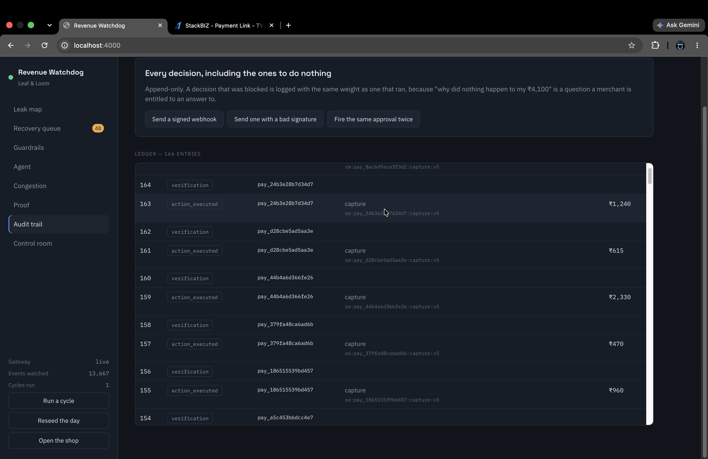

*Replay safety is visible, not just asserted.*

```bash
npm start
```

**Make a payment fail.** Open the storefront at `/store.html`, click Buy, and in the
Razorpay modal use UPI ID `failure@razorpay`. Card `4111 1111 1111 1111` with any future
expiry succeeds. Netbanking shows a mock page with explicit Success and Failure buttons.

**What then happens**

```
Buy on the storefront
  → POST /api/create-order → Razorpay POST /v1/orders
  → Checkout.js opens the real Razorpay modal
  → pay with failure@razorpay
  → Razorpay sends payment.failed to the webhook tunnel
  → HMAC verified, event deduplicated, payment ingested
  → runCycle() fires, detectRealFailures() picks it up immediately
  → Gemini investigates with 8 read-only tools; every claim is validated
  → the deterministic policy engine gates the proposed action
  → on AUTO: POST /v1/payment_links creates a real link
  → customer pays it
  → payment_link.paid arrives, recovery attributed to the deciding action
  → leak map shows ₹X recovered, traced to the specific decision that caused it
```

Real failed payments become candidates immediately regardless of volume. The
statistical detectors exist to find patterns in aggregate traffic, not to gate whether
your own test payment is allowed to appear.

### The live path, end to end

Everything above this section runs on seeded traffic. This section does not. Leaf &
Loom (`acc_LEAFANDLOOM`) is the focus merchant, and payments made through its
storefront are real Razorpay test-mode payments: they carry a `source` marker, they
are never given a fabricated outcome, and they stay `pending` until a webhook says
otherwise.

It is the smallest part of the system and the only part where the number is not
downstream of an assumption I wrote. Seven frames, one rupee:

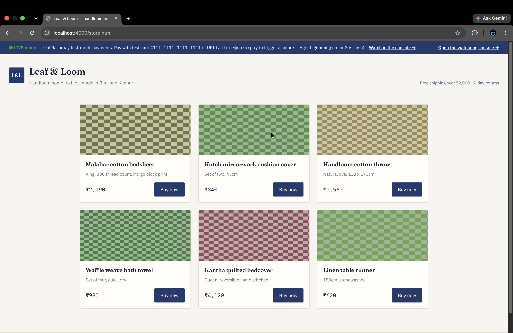

**1. The storefront.** A real product, a real cart, a real order about to be created through `POST /v1/orders`.

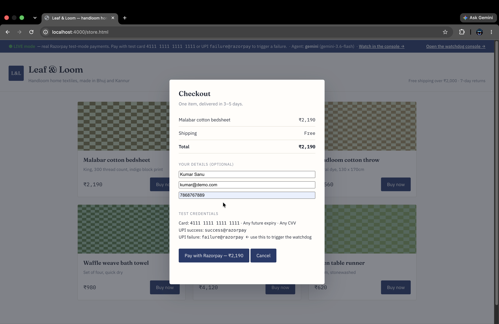

**2. Razorpay Checkout.** The actual modal from `checkout.razorpay.com`, not a mock. Use UPI ID `failure@razorpay` to force the failure this system exists to recover.

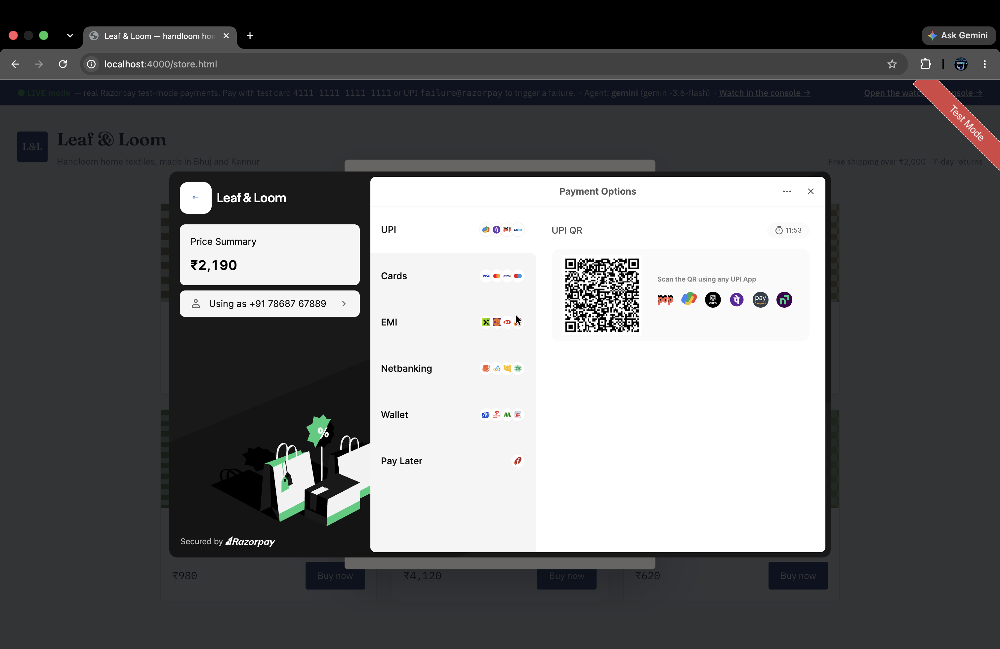

**3. Ingested and tagged.** It lands under Real payments with `source: razorpay`, held apart from the 13,629 seeded rows. Nothing in the simulator is allowed to touch it.

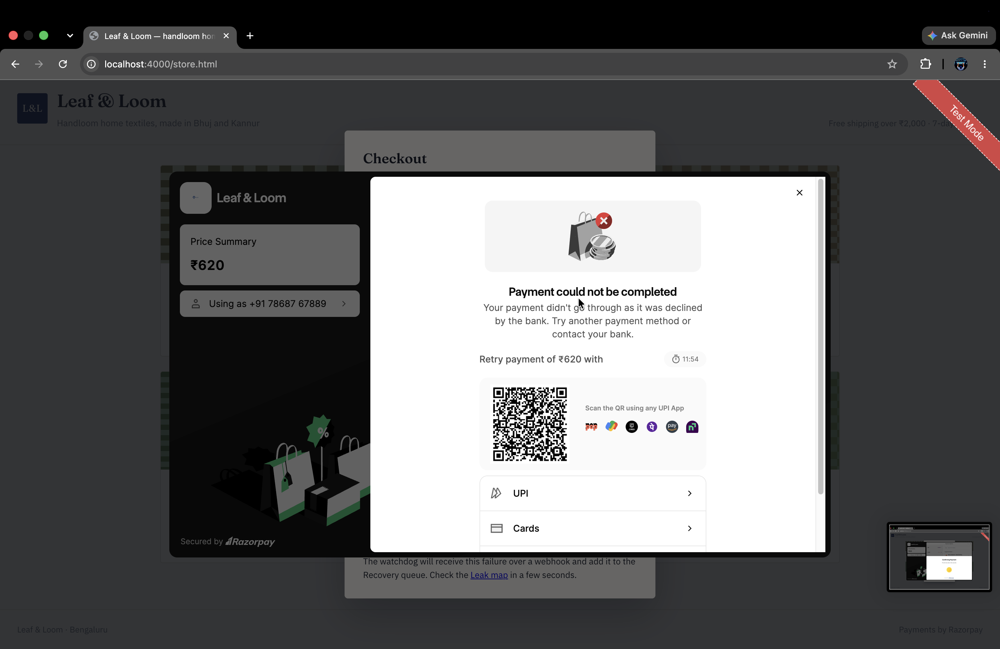

**4. It becomes a candidate.** Decline class, model probability, and policy verdict — computed exactly as for every seeded candidate.

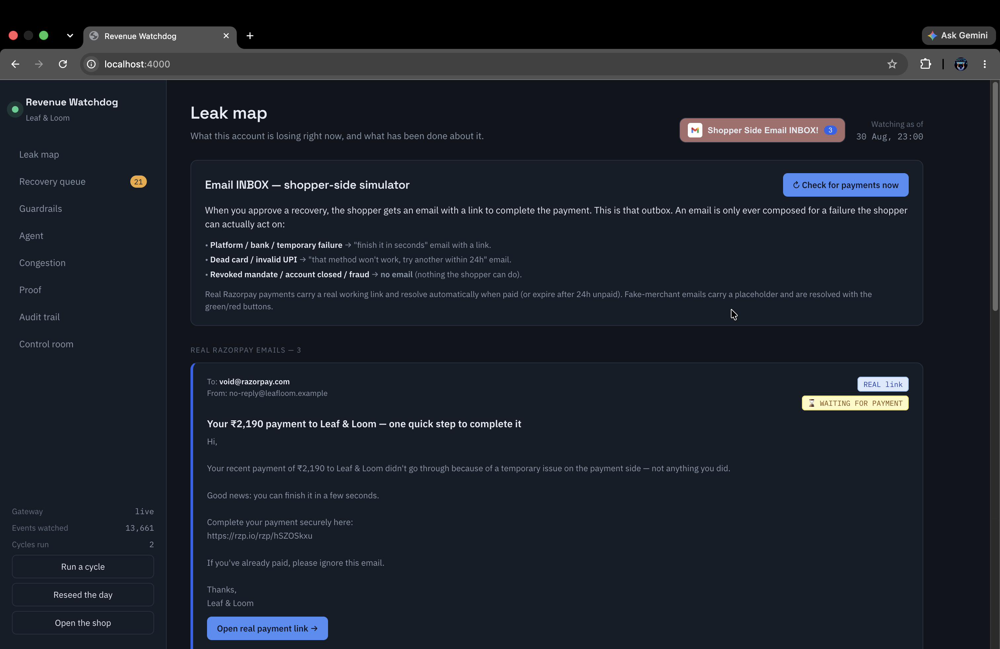

**5. A real link.** `POST /v1/payment_links` returns a genuine `rzp.io` short URL, sent with an idempotency key so a retried request cannot double-charge.

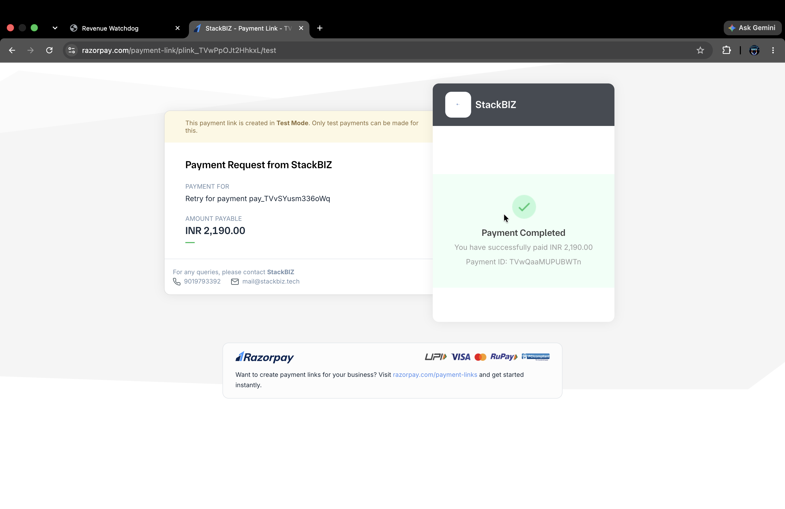

**6. The truth arrives.** HMAC verified before parsing, deduplicated on event id, ordered by state rank. This is the moment the outcome stops being a guess.

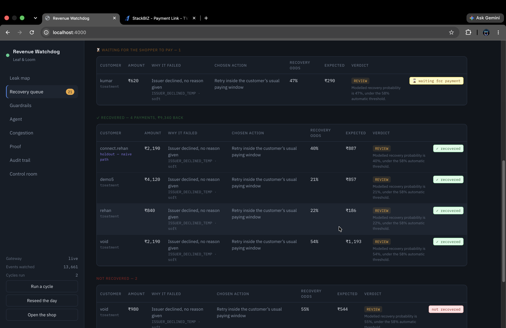

**7. Attributed.** Not "revenue went up" — *this* decision recovered *this* payment.

**1. The storefront.** A real product, a real cart, a real order about to be created
through `POST /v1/orders`.

**2. Razorpay Checkout.** The actual modal from `checkout.razorpay.com`, not a mock.
Use UPI ID `failure@razorpay` to force the failure this whole system exists to recover.

**3. Ingested and tagged.** The payment lands under Real payments with
`source: razorpay`, held apart from the 13,629 seeded rows. Nothing in the simulator
is allowed to touch it.

**4. It becomes a candidate.** Decline class, model probability, and the policy
verdict — computed the same way as for every seeded candidate.

**5. A real link.** `POST /v1/payment_links` returns a genuine `rzp.io` short URL,
sent with an idempotency key so a retried request cannot double-charge.

**6. The truth arrives.** `payment_link.paid`, HMAC verified before parsing,
deduplicated on event id, ordered by state rank. This is the moment the outcome stops
being a guess.

**7. Attributed.** The recovered rupee is traced back to the specific decision that
caused it. Not "revenue went up" — *this* decision recovered *this* payment.

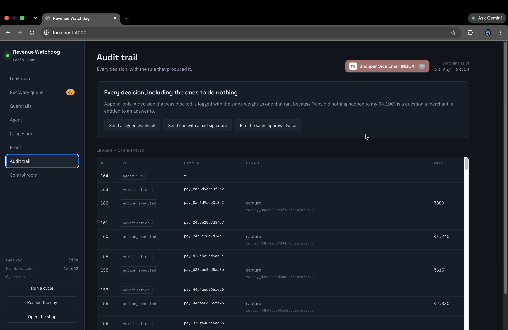

*Sidebar → Audit trail. One full chain, from the decision made to the rupee that came back.*

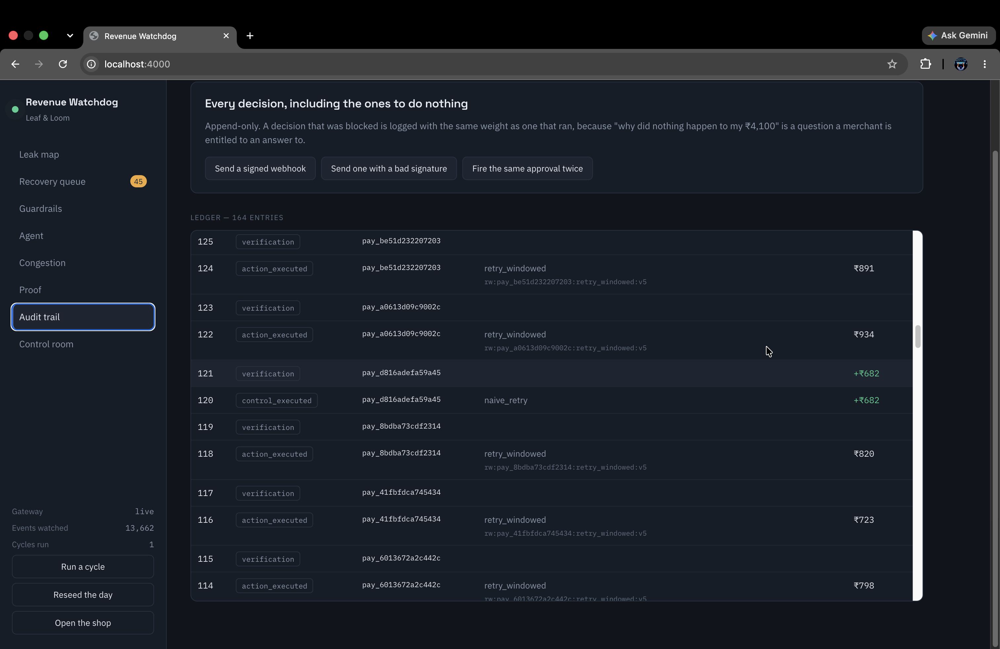

*Blocks and reviews leave the same trace as executions. A decision not to act is still a decision.*

---

## Layout

```
src/
  pipeline/
    coordinator.js   network-wide retry congestion control + fairness curve
    capacity.js      online issuer-capacity estimation, and refusing to guess
    detectors.js     CUSUM, MLE change-point, beta-binomial, cross-network correlation
    policy.js        deterministic AUTO / REVIEW / BLOCK gate
    model.js         recovery probability, calibrated and scored
    execute.js       the only code that can call a write endpoint
    cycle.js         one full detect → diagnose → gate → act pass
  agent/
    loop.js          tool-use loop
    tools.js         8 read-only tools + 1 proposal tool
    validator.js     every number must trace back to a fact
    guard.js         untrusted-input handling
  razorpay/
    webhooks.js      HMAC verification, deduplication, ordering
    ingest.js        real payments, kept separate from seeded traffic
    client.js        Razorpay API
scripts/
  selftest.js        66 assertions
  evals.js           12 agent scenarios, including unwinnable ones
  accumulate.js      30-day A/B with significance testing
```

9,821 lines of JavaScript. No dependencies.

---

## License

MIT. See [LICENSE](LICENSE).