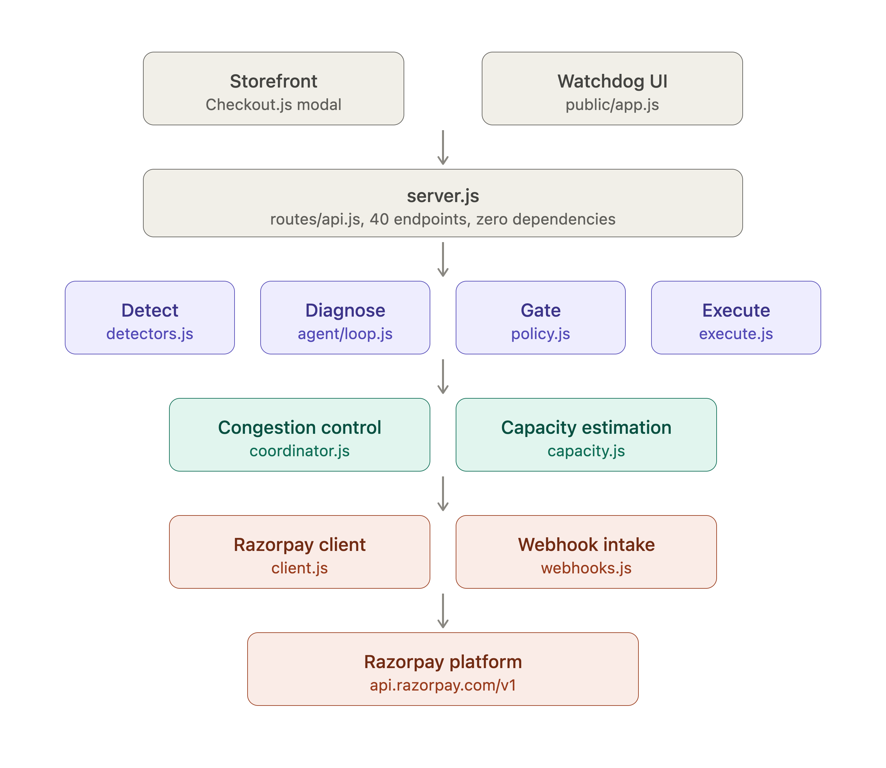
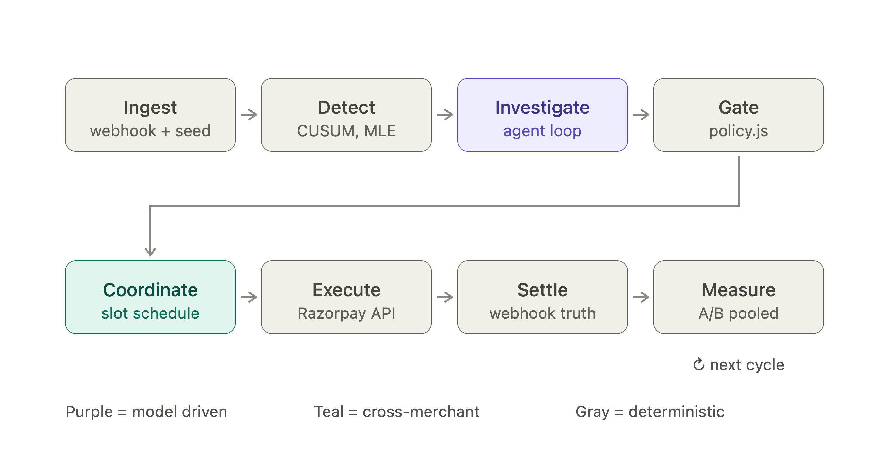
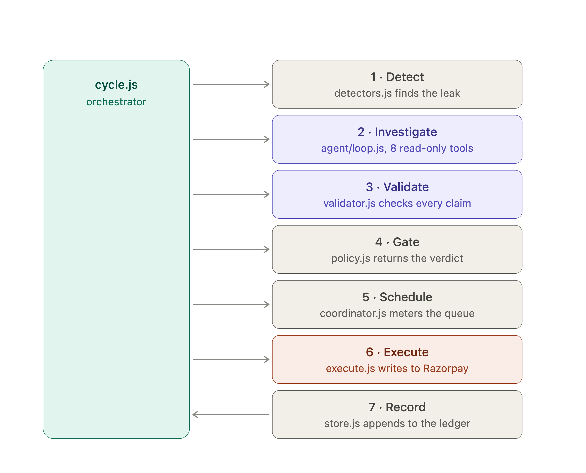
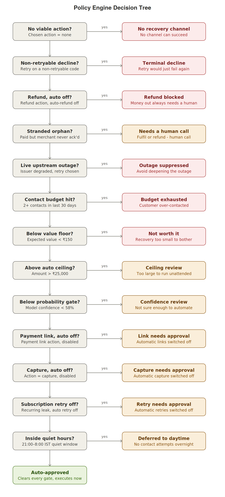
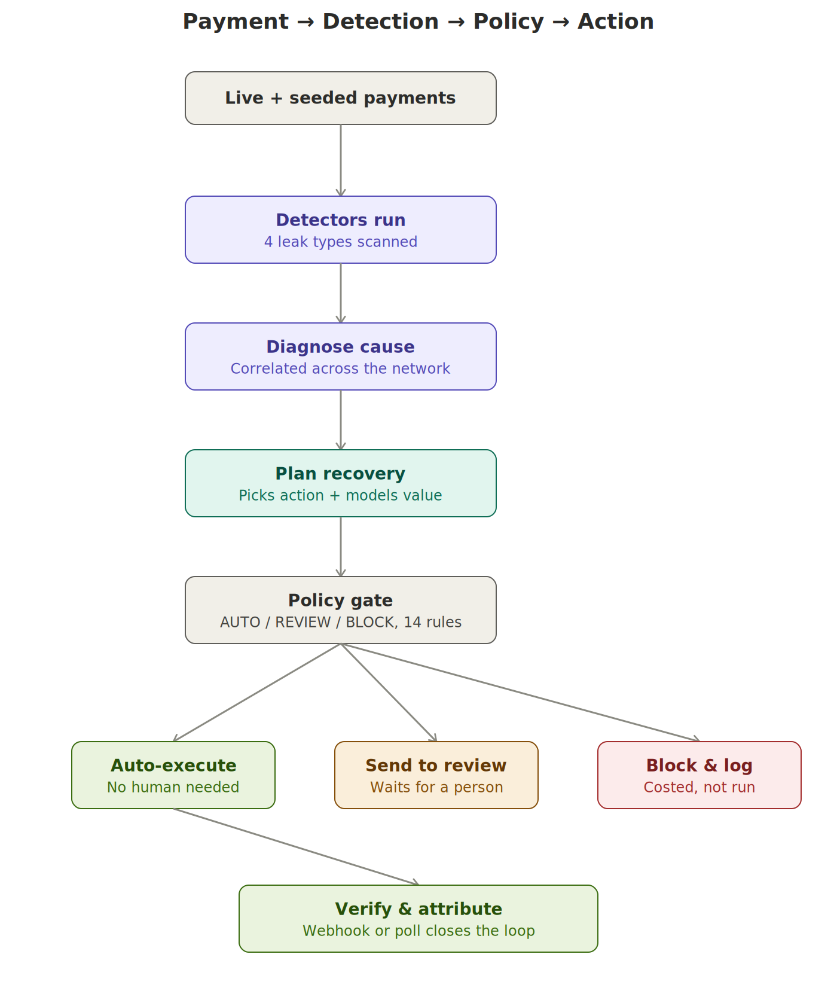
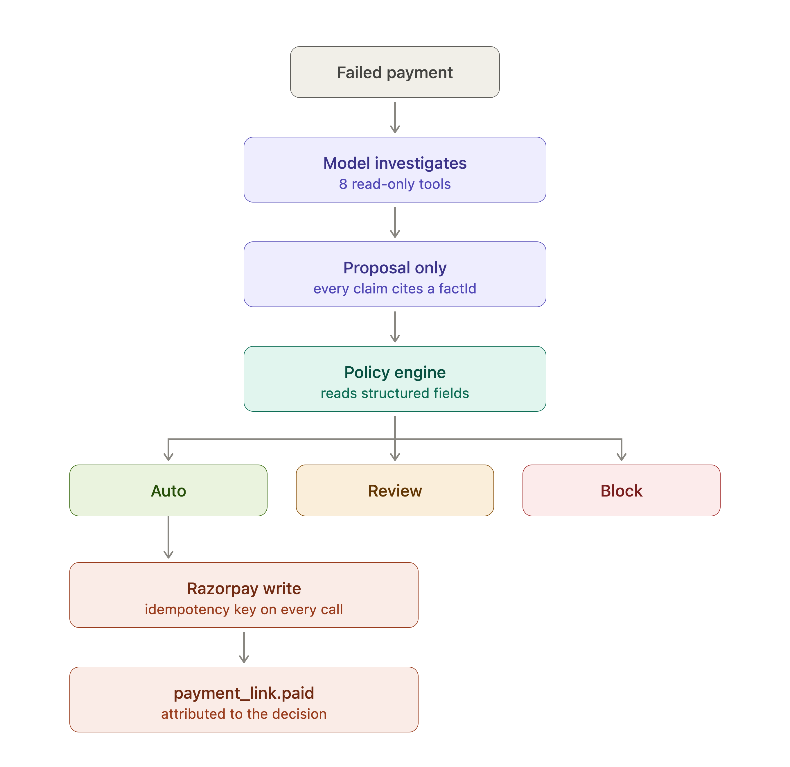
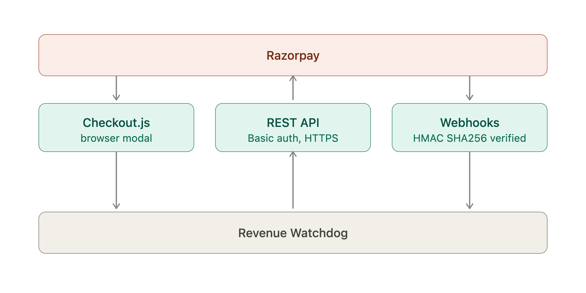
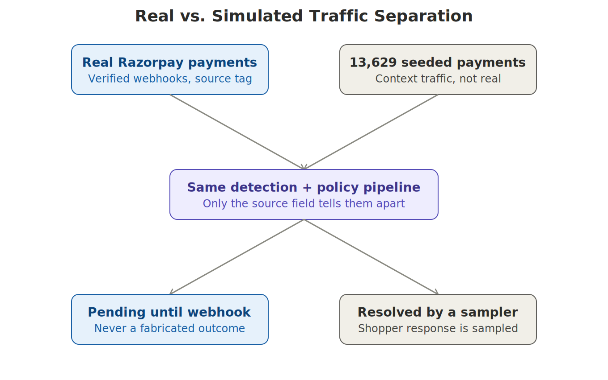
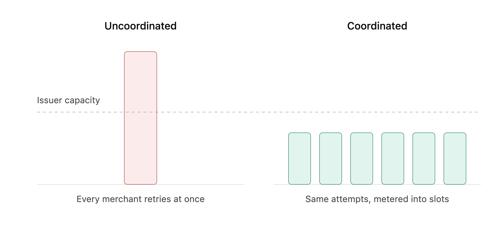
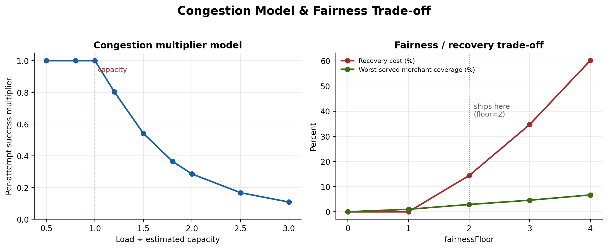

# Revenue Watchdog — Architecture

Retry congestion control for the Razorpay network, plus a merchant-facing recovery agent that can investigate but cannot move money.

This document describes the system end to end: the components, how a payment moves through them, where AI sits in the loop, and where the boundary between real and simulated traffic is drawn. It is meant to be read alongside the [README](./README.md), which carries the results and the honesty sections; this document carries the structure.

---

## Table of contents

1. [System overview](#system-overview)
2. [Operational cycle](#operational-cycle)
3. [Orchestration: one cycle in `cycle.js`](#orchestration-one-cycle-in-cyclejs)
4. [Policy engine decision tree](#policy-engine-decision-tree)
5. [Data flow: payment → detection → policy → action](#data-flow-payment--detection--policy--action)
6. [Agent containment and the money-movement path](#agent-containment-and-the-money-movement-path)
7. [Razorpay integration boundary](#razorpay-integration-boundary)
8. [Real vs. simulated traffic separation](#real-vs-simulated-traffic-separation)
9. [Retry stampede vs. coordinated scheduling](#retry-stampede-vs-coordinated-scheduling)
10. [Congestion model & fairness trade-off](#congestion-model--fairness-trade-off)
11. [Repository layout](#repository-layout)
12. [What is verified](#what-is-verified)
13. [Known limitations](#known-limitations)

---

## System overview



The system is a single Node process with no external dependencies (`package.json` has an empty `dependencies` block). It is organised into five layers:

| Layer | Responsibility | Location |
|---|---|---|
| Ingestion | Converts real Razorpay webhooks and seeded synthetic payments into one internal shape | `src/razorpay/ingest.js`, `src/razorpay/webhooks.js` |
| Detection | Statistical detectors that find leaks: instrument degradation, recurring failures, stranded money, real failures | `src/pipeline/detectors.js` |
| Diagnosis & planning | Cross-network correlation, narrated cause, action selection, probability and value modelling | `src/pipeline/diagnose.js`, `src/pipeline/planner.js`, `src/pipeline/model.js` |
| Policy & scheduling | Deterministic AUTO/REVIEW/BLOCK gating, retry congestion control, fairness allocation | `src/pipeline/policy.js`, `src/pipeline/coordinator.js`, `src/pipeline/capacity.js` |
| Execution & agent | The only code that can call a write endpoint; a read-only investigation agent with one gated proposal tool | `src/pipeline/execute.js`, `src/agent/*` |

The design principle that runs through all five layers: **detection and diagnosis are probabilistic, but authorisation to act is not**. Every layer upstream of the policy engine can be wrong, imprecise, or model-driven — the policy engine itself is a pure function of structured fields, with no model and no LLM in its decision path.

---

## Operational cycle



One full pass is **watch → diagnose → quantify → plan → gate → act → verify**, run by `runCycle()` in `src/pipeline/cycle.js`. The ordering is deliberate:

- **Watch** is broad and cheap — every detector runs on every cycle regardless of whether anything is wrong.
- **Diagnose** is where the cross-merchant network signal turns a raw number into a stated cause (`merchant_local` vs. `upstream`), narrated by Gemini for readability, never for the underlying verdict.
- **Quantify** produces a probability and an expected value per candidate action, from a calibrated model, not the LLM.
- **Plan** allocates under a per-customer contact budget.
- **Gate** is the policy engine — the only component authorised to permit an action.
- **Act** executes only AUTO-verdict candidates automatically; REVIEW candidates wait for `approveCandidate()`.
- **Verify** closes the loop — a webhook or a reconciliation poll, never an assumption.

---

## Orchestration: one cycle in `cycle.js`



Inside `runCycle()`, the call order is fixed and matters:

1. `expireStalePendingActions()` — closes out real recovery links that have sat unpaid for 24h before anything else runs, so stale pending state never leaks into a fresh cycle.
2. `detectRealFailures()` — real, observed Razorpay failures become candidates immediately, regardless of statistical volume.
3. `detectInstrumentDegradation()` → `correlateAcrossNetwork()` → `diagnoseDegradation()` → `polishNarrative()` — the network-signal path.
4. `detectRecurringFailures()` → `diagnoseRecurring()`.
5. `detectStrandedPayments()` → `diagnoseStranded()`.
6. For every payment attached to every investigation: `planRecovery()` then `evaluate()` (the policy engine) — a candidate always carries its own verdict before it is stored.
7. Prior resolutions are carried forward by `paymentId`, not by candidate id, so a payment already approved, recovered, or rejected in an earlier cycle can never be re-actioned or double-emailed.
8. Only for `verdict === 'AUTO'`: `execute()` (or `executeControl()` for the A/B control arm) then `verify()`.

This ordering is what makes the safety claims in this document checkable in code, not just in prose: nothing between step 6 and step 8 can promote a candidate's verdict.

---

## Policy engine decision tree



`evaluate()` in `src/pipeline/policy.js` runs fourteen rules in strict, first-match-wins order and returns exactly one of `AUTO`, `REVIEW`, or `BLOCK`. Two design choices are load-bearing:

- **Refund is never automatic**, at any confidence level — there is no probability high enough to justify unattended money leaving the account.
- **Every `BLOCK` is costed.** The engine records the `expectedValue` it declined to pursue (`foregoneValue`), so the merchant sees the price of the system's own caution instead of assuming safety is free.

The gates, in order, with their live thresholds (`src/config.js`, policy version 4):

| # | Gate | Threshold | Verdict if triggered |
|---|---|---|---|
| 1 | No viable action | `action === 'none'` | BLOCK |
| 2 | Non-retryable decline | retry on a non-retryable code | BLOCK |
| 3 | Refund requires a human | `allowAutomaticRefund = false` | BLOCK |
| 4 | Stranded orphan payment | captured but never acknowledged | REVIEW |
| 5 | Live upstream outage | issuer degraded, action is retry | BLOCK |
| 6 | Contact budget | ≥ 2 contacts in 30 days | BLOCK |
| 7 | Value floor | expected value < ₹150 | BLOCK |
| 8 | Auto ceiling | amount > ₹25,000 | REVIEW |
| 9 | Probability gate | model confidence < 58% | REVIEW |
| 10 | Payment link switch | `allowAutomaticPaymentLink = false` | REVIEW |
| 11 | Capture switch | `allowAutomaticCapture = false` | REVIEW |
| 12 | Subscription retry switch | `allowAutomaticSubscriptionRetry = false` | REVIEW |
| 13 | Quiet hours | 21:00–8:00 IST, contact-costing action | REVIEW |
| — | Everything else | clears all thirteen gates | **AUTO** |

`simulate()` in the same file backtests any candidate policy change against the existing ledger before it is switched on, reporting exactly which candidates would move to or off AUTO and what that is worth — this is what powers the Control room's `simulate_policy_change` view.

---

## Data flow: payment → detection → policy → action



A single payment's path through the system, end to end: it enters as either a live webhook or seeded traffic, is picked up by one of four detectors, diagnosed with network context, planned into a candidate action with a modelled probability and value, and gated by the policy engine into one of three terminal states. Only the AUTO path continues into execution and verification — REVIEW candidates stop and wait for a person, and BLOCK candidates stop permanently, logged with their foregone value.

---

## Agent containment and the money-movement path



This is an architectural claim, not a policy one: **there is no route from the model to the executor.**

The investigation agent (`src/agent/loop.js`, `src/agent/tools.js`) has nine tools. Eight are read-only: `list_open_leaks`, `inspect_payment`, `get_decline_breakdown`, `get_customer_history`, `estimate_recovery_probability`, `check_congestion`, `compare_across_network`, `simulate_policy_change`. The ninth, `propose_recovery_posture`, writes a proposal and nothing else. Every action the system actually takes passes through the same deterministic `evaluate()` policy engine described above, which reads only structured candidate fields — it never reads free text, and it never asks the model for permission.

Two further layers sit around the agent, both enforced in code rather than by instruction:

- **Grounded claims** (`src/agent/validator.js`) — every number the agent states must trace back to a `factId` from an actual tool result. Identifiers and timestamps are excluded from the pool of matchable numbers by key and by shape, after a real incident where a fabricated `87.3%` validated against a digit fragment inside a payment ID.
- **Untrusted input handling** (`src/agent/guard.js`) — payment descriptions, customer names, and order notes are written by people outside the system. Suspected injected content is *replaced*, not merely flagged, because a warning still puts the payload in the model's context.

The test suite pins all three claims directly:

```
ok    the agent has no tool that can move money
ok    the only write-shaped tool is a proposal
ok    nothing executed without a rule authorising it
```

---

## Razorpay integration boundary



The system talks to Razorpay across three distinct surfaces, each with its own trust and verification model:

1. **Checkout surface** (`public/store.js`, `POST /api/create-order`) — a real storefront creating real test-mode orders through `checkout.razorpay.com`. Nothing here is mocked.
2. **Webhook surface** (`src/razorpay/webhooks.js`) — inbound events (`payment.failed`, `payment.captured`, `payment_link.paid`) are HMAC-verified before parsing, deduplicated by event id, and ordered by state rank so an out-of-order delivery cannot regress a payment's status.
3. **Write-API surface** (`src/pipeline/execute.js`, `src/razorpay/client.js`) — the only code path allowed to call `POST /v1/payment_links`, capture, or refund. Every write carries an idempotency key, so a retried request cannot double-charge or double-send a recovery link.

Because the webhook surface needs Razorpay to reach the local machine, the live path is exposed through a `cloudflared` tunnel during development; the tunnel is not part of the trust boundary itself — HMAC verification is.

---

## Real vs. simulated traffic separation



Real Razorpay payments and the 13,629 seeded synthetic payments enter the **same** detection and policy pipeline — nothing in detection, planning, or policy branches on where a payment came from. Exactly one field, `source`, distinguishes them, and exactly two places in the code read it:

- `execute.js` refuses to sample a fabricated outcome for a real payment (`payment?.source === 'razorpay'`) — a real action can only be marked recovered by a real webhook or a real reconciliation poll against Razorpay's own API.
- The reconciliation loop skips real payments outright (`if (payment?.source === 'razorpay') continue`) — real money is never ours to decide the outcome of.

Everything else — the seeded generator, the leak map, the recovery model — treats a real and a simulated payment identically until one of those two checks is hit.

---

## Retry stampede vs. coordinated scheduling



The problem this component exists to solve is a coordination failure no single merchant can fix alone. When an issuer degrades, every merchant's dunning logic notices at roughly the same time and retries immediately — none of them can see each other, so a bank that is already struggling receives a synchronised burst on top of its organic load. Retries deepen and lengthen the outage; every merchant's success rate drops further as a result of everyone's individually rational behaviour.

`src/pipeline/coordinator.js` is the layer that can see all merchants at once, and does three things a single-merchant retry loop structurally cannot:

- Meters total retry traffic to a degraded issuer against an estimated network-wide capacity.
- Spreads attempts across one-minute time slots instead of firing them together (`scheduleCoordinated`).
- Allocates the scarce early slots by expected value, subject to a per-merchant fairness floor, rather than by whichever merchant's cron fired first.

---

## Congestion model & fairness trade-off



**Congestion model.** `congestionMultiplier(load, capacity)` is flat at 1.0 while offered load stays at or under estimated capacity, then falls off superlinearly: `1 / (1 + excess² × 1.6 + excess × 0.9)` where `excess = load/capacity − 1`. At double capacity, per-attempt success falls to roughly 29%. This shape is an explicit assumption (documented and labelled as such in `config.js`); what is not an assumption is that both the coordinated and uncoordinated arms are scored against the *same* curve, so the comparison between them holds regardless of whether the absolute capacity figure is correct.

**Fairness trade-off.** Pure expected-value ordering is not a neutral default — it is a policy that serves the smallest merchants on the network last during a long outage. `fairnessCurve()` sweeps a per-merchant floor and publishes what each setting costs:

| `fairnessFloor` | Expected recovery | Worst-served merchant | Recovery cost |
|---|---|---|---|
| 0 | ₹10.85 Cr | 0% | — |
| 1 | ₹10.85 Cr | 1.0% | 0% |
| **2 (ships here)** | ₹9.29 Cr | 2.9% | 14.4% |
| 3 | ₹7.08 Cr | 4.6% | 34.7% |
| 4 | ₹4.32 Cr | 6.7% | 60.2% |

Floor 2 is a stated policy choice, not an optimum — it is printed next to its price specifically so it can be argued with.

---

## Repository layout

```
src/
  pipeline/
    coordinator.js   network-wide retry congestion control + fairness curve
    capacity.js      online issuer-capacity estimation, and refusing to guess
    detectors.js     CUSUM, MLE change-point, beta-binomial, cross-network correlation
    policy.js        deterministic AUTO / REVIEW / BLOCK gate
    model.js         recovery probability, calibrated and scored
    execute.js       the only code that can call a write endpoint
    cycle.js         one full detect → diagnose → gate → act pass
  agent/
    loop.js          tool-use loop
    tools.js         8 read-only tools + 1 proposal tool
    validator.js     every number must trace back to a fact
    guard.js         untrusted-input handling
  razorpay/
    webhooks.js      HMAC verification, deduplication, ordering
    ingest.js        real payments, kept separate from seeded traffic
    client.js        Razorpay API
scripts/
  selftest.js        66 assertions
  evals.js           12 agent scenarios, including unwinnable ones
  accumulate.js      30-day A/B with significance testing
```

9,821 lines of JavaScript. Zero npm dependencies — nothing to break between one machine and another.

---

## What is verified

```
npm test      # 66 assertions, 0 failures
npm run evals # 12 agent scenarios
npm run accumulate # 30-day A/B, control vs. treatment
```

The self-test suite covers policy gating, idempotency under replay, webhook HMAC verification and deduplication, out-of-order event handling, agent capability limits, claim validation, injection handling, congestion monotonicity, recovery attribution, and accounting identities (recovered never exceeds at-risk; flow buckets sum to the total). The eval harness scores cause attribution, posture selection, claim grounding, and tool-call efficiency across 12 scenarios — including scenarios the agent is meant to find unwinnable, so a harness of only-winnable cases can't inflate the score.

Current result: **10 of 12 evals pass**, cause attribution 100%, posture selection 100%, fully grounded on all runs, 3.7 tool calls average.

---

## Known limitations

1. **The A/B lift is measured against a simulator whose generating function shares a feature set with the policy** — `trueRecoveryProbability()` in the seed generator and `contextFor()` in the planner take the same arguments, so the measurement machinery is fully exercised but the +16.02pp effect size is a statement about the simulator, not yet about production traffic.
2. **Two eval scenarios fail** on a `mustMention` completeness check (the agent reaches the right cause and posture but omits naming a specific issuer or merchant count) — grounding and injection resistance pass in both.
3. **Capacity is not identifiable at demo volume** — the estimator is tested against a planted capacity and correctly refuses to report one on every seeded issuer, since 13,629 payments over 157 hours never approaches the modelled ceiling.
4. **Background traffic is synthetic** — only the live path through the Leaf & Loom storefront carries genuinely real, unfabricated outcomes.
5. **Detection on an unseen issuer falls back to an assumed baseline** (`ASSUMED_BASELINE_RATE = 0.92`), marked `baselineAssumed: true` rather than presented as measured.

---

*This document describes the system as implemented in `src/`. Where a figure or threshold changes in code, this document should be regenerated from source rather than hand-edited, to avoid drift between the two.*